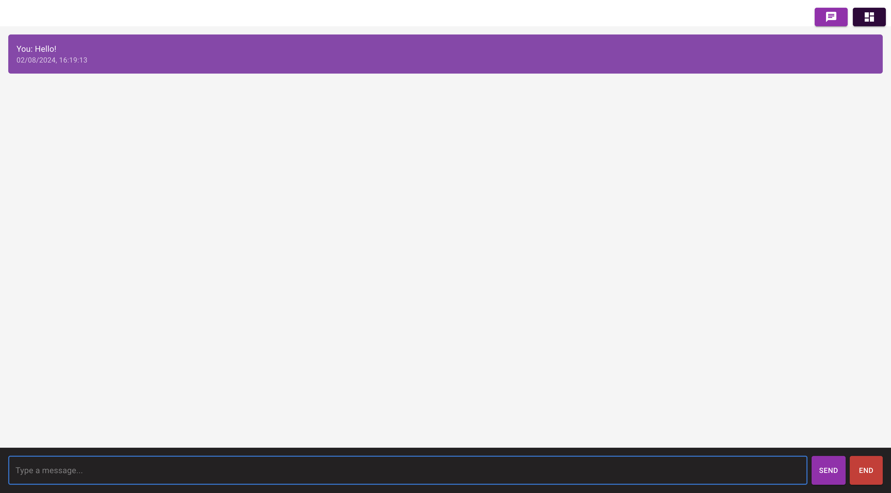
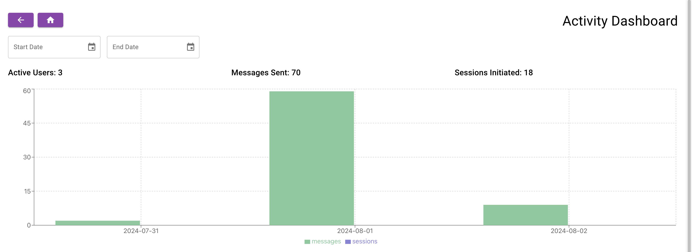
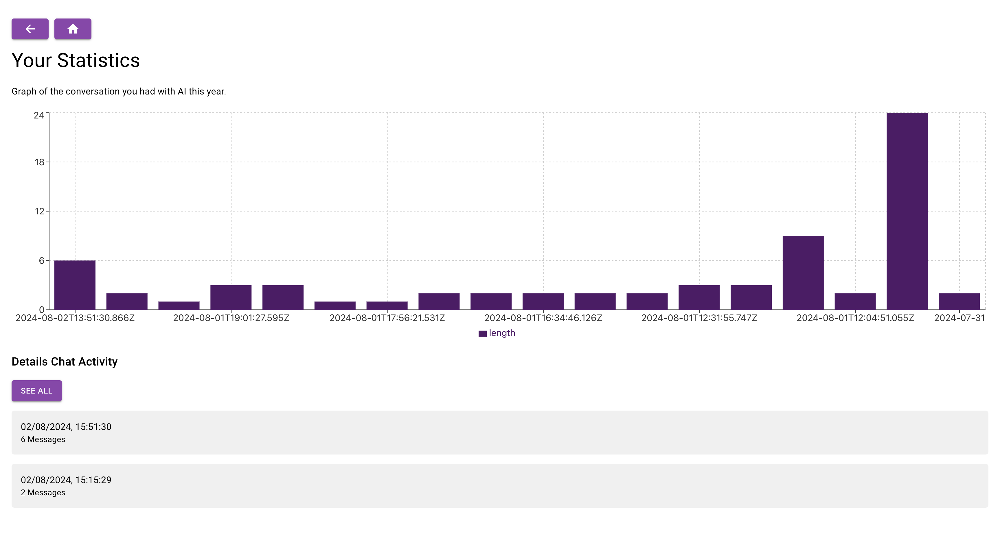

# Cosmo Chat Application

Welcome to Cosmo Chat, a chat application integrated with OpenAI's API. This project allows users to interact with an AI chatbot, save their chat messages, and view detailed analytics of their interactions.

## Table of Contents

- [Features](#features)
- [Installation](#installation)
- [Usage](#usage)
- [Screenshots](#screenshots)
- [Technologies Used](#technologies-used)
- [Contributing](#contributing)
- [License](#license)

## Features

- **Home Page**: Start a chat with a click of a button.
- **AI Integration**: Communicate with an AI using OpenAI's API.
- **Message Saving**: Save chat messages and sessions locally.
- **Real-time Communication**: Utilize WebSocket for real-time message updates.
- **Activity Dashboard**: View a graphical representation of your chat history by date.
- **User Dashboard**: Analyze users, chats, and messages based on selected dates.
- **Material-UI**: Stylish and responsive UI components.

## Installation

To run this project locally, follow these steps:

1. **Clone the repository**:

   ```sh
   git clone https://github.com/your-username/cosmo-chat.git
   cd cosmo-chat
   ```

2. **Install dependencies**:

   ```sh
   npm install
   ```

3. **Set up the OpenAI API**:

   - Obtain an API key from [OpenAI](https://beta.openai.com/signup/).
   - Create a `.env` file in the root directory and add your API key:
     ```env
     REACT_APP_OPENAI_API_KEY=your_openai_api_key
     ```

4. **Set up the WebSocket server**:

   - Ensure you have a WebSocket server running. This project assumes it's running at `http://localhost:3001`.

5. **Start the development server**:
   ```sh
   npm start
   ```

## Usage

1. **Home Page**: Click the "Start Chat" button to begin interacting with the AI.
2. **Chat Page**: Send messages to the AI. Your messages will be saved automatically and updated in real-time.
3. **Activity Dashboard**: Navigate to the activity dashboard to view chat analytics by date.
4. **User Dashboard**: Select a date to see detailed user activity, including users, chats, and messages sent.

## Components

- **Home**: The landing page with a welcome message and a button to start chatting.
- **Chat**: The chat interface where users can communicate with the AI.
- **Activity Dashboard**: Displays a graph of chat activities over time.
- **User Dashboard**: Provides detailed analytics based on user activity and selected dates.

## Screenshots

### Home Page


### Chat Page



### Activity Dashboard



### User Dashboard



## Technologies Used

- **React**: JavaScript library for building user interfaces.
- **Material-UI**: React component library for faster and easier web development.
- **Socket.IO**: Real-time bidirectional event-based communication.
- **OpenAI API**: Integration for AI-powered chat responses.
- **WebSocket**: Protocol for real-time communication.

## Contributing

We welcome contributions! Please follow these steps to contribute:

1. Fork the repository.
2. Create a new branch:
   ```sh
   git checkout -b feature/your-feature-name
   ```
3. Commit your changes:
   ```sh
   git commit -m 'Add your feature'
   ```
4. Push to the branch:
   ```sh
   git push origin feature/your-feature-name
   ```
5. Open a pull request.

## License

This project is licensed under the MIT License. See the [LICENSE](LICENSE) file for more details.

---

**Happy Chatting!** 🚀👾💬
